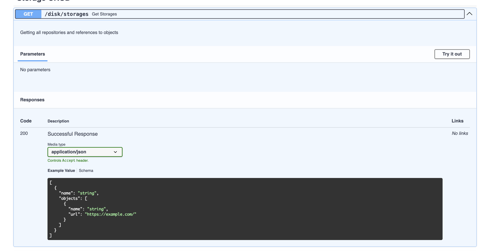

Используя документацию OpenAPI (Swagger) вы можете тестировать API. Более 20 ручек для использования.
TDisk делеться на условные секции. Каждая секция предаставляет свои функции.

## Storage CRUD
В этой секции ручки для создания, чтения, обновления и удаления хранилищей. Вы можете узнать все файлы, хранящиеся в хранилище используя endpoint:

## Object CRUD
В данной секции происходят операции по добавлению, удалению и чтению объектов. Вы можете добавлять объекты в хранилища. На данный момент доступно только добавление и удаление объекта. Для чтения (скачивания) объекта есть другая секция.

## Setting
Тут пользователь может изменить параметры хранилища. Например сделать хранилище публичным или частным. А если хралинище частное, то можно добавлять участников, которые смогут скачивать объекты с хранилища. Еще можно узнать данные о диске (сколько занято и сколько свободно).

## Dowload Files
В данной секции устанавливаются объекты. Вы можете установить сразу все объекты хранилища.

## API
Это АПИ для работы с хранилищем для пользователя.

## Admin панель
Для входа в админ панель перейдите на [http://127.0.0.1:8000/admin](http://127.0.0.1:8000/admin) и введите логин и пароль (данные для входа будут находиться в файле .env). В панеле вы сможете видеть данные базы данной.

