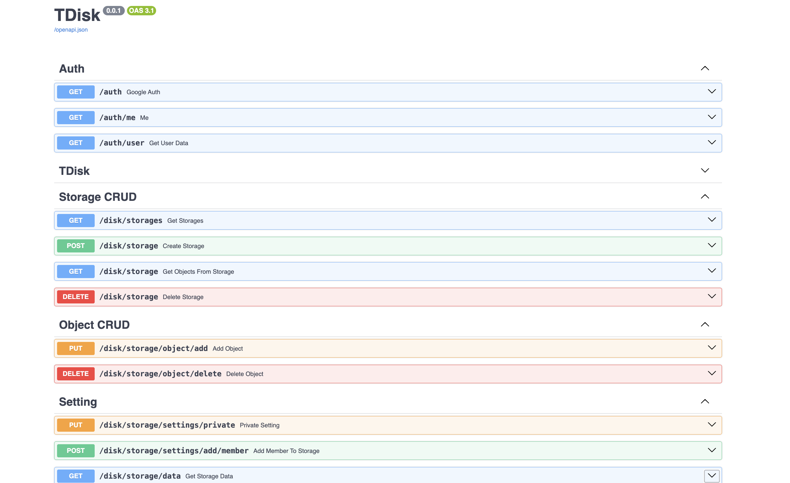

# TDisk API
Это проект написанный на FastAPI с использованием PostgreSQL, Redis и Minio.
Данный АПИ служит для хранения пользовательских данный на облачном диске.

## Про API
TDisk API предоставляет возможность хранить файлы на облачном диске. Вы можете создавать приватные или публичные хранилища.

