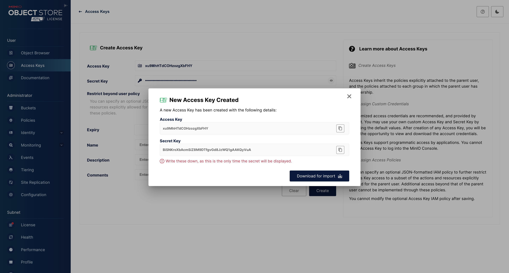

Для начало скачиваем проект с GitHub
```
git clone https://github.com/GwenB1ade/TDisk .
```

После создаем контейнеры через докер:

```
docker-compose up --build
```


Дальше переходим в директорию src и запускаем FastAPI приложение. Но перед этим создадим виртуальное окружение и установим библиотеки. Для этого в терминале пишем такой код:
```
python3 -m venv .venv
. .venv/bin/activate
pip3 install -r req.txt
```

### Minio
Дальше следует настроить Minio.
Переходим на [http://127.0.0.1:9001](http://127.0.0.1:9001)
В форме входа вводим логин и пароль (Данные для входа находяться в файле .env)
После успешного входа переходим на [Access Keys](http://127.0.0.1:9001/access-keys) и создаем ключ. Эти ключи вы должны обязательно записать в .env файл (имена: MINIO_ACCESS_KEY, MINIO_SECRET_KEY)


После всего переходим в [Buckets](http://127.0.0.1:9001/buckets) и ищем disk (У вас его не будет, поэтому создайте) и меняем Access Policy:

```JSON
{
    "Version": "2012-10-17",
    "Statement": [
        {
            "Effect": "Allow",
            "Principal": {
                "AWS": [
                    "*"
                ]
            },
            "Action": [
                "s3:GetObject"
            ],
            "Resource": [
                "arn:aws:s3:::disk/*"
            ]
        }
    ]
}

```

# Запуск FastAPI приложения

```
python3 main.py
```

Поздравляем, приложение TDisk было успешно запущено