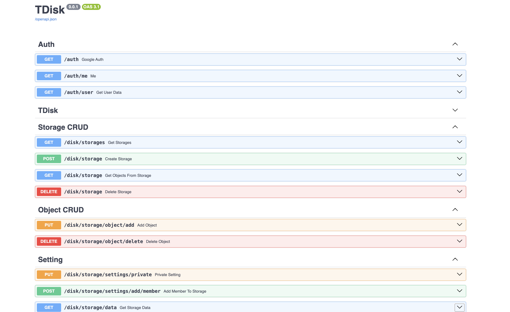

Перейдите на [http://127.0.0.1:8000/docs](http://127.0.0.1:8000/docs) для открытия документации.

Основные функции этого приложения: хранения пользовательскиъ данных в приложении. Добавление, удаление и получение данных. 

Перед началом пользователю необходимо авторизоваться. Для этого нужна почта и пароль.

После регистрации аккаунта, пользователь необходим войти в свой аккаунт, предоставив почту и пароль.

Теперь пользователю открываеться весь функционал.

